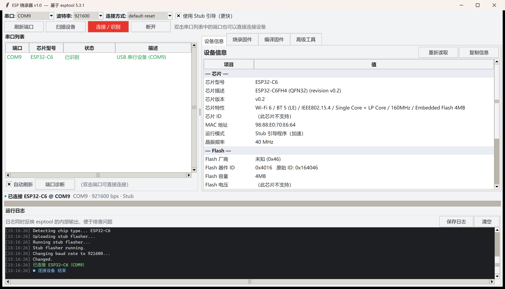
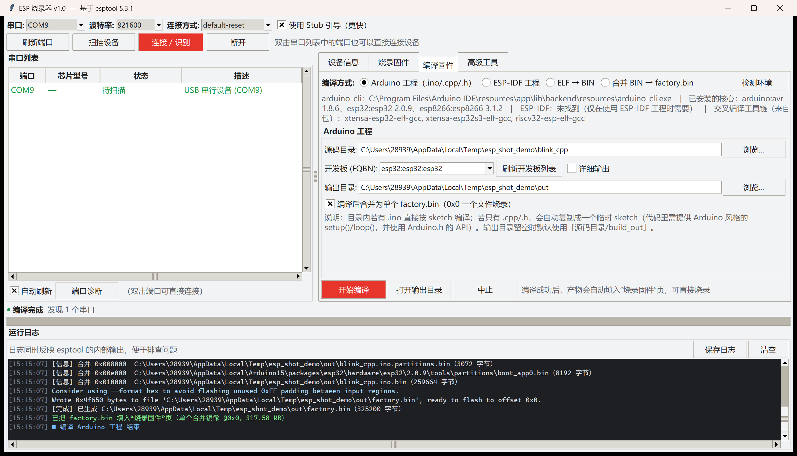
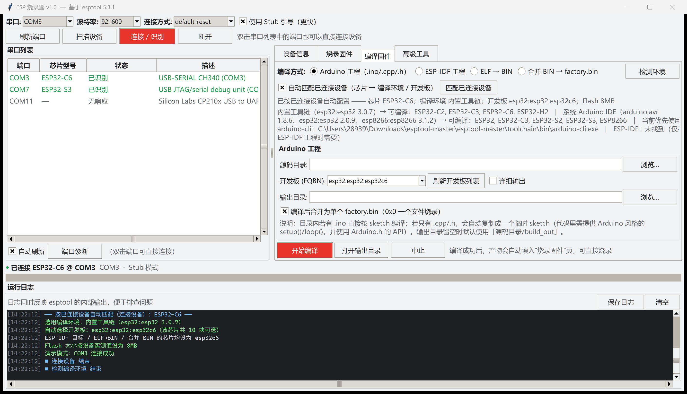
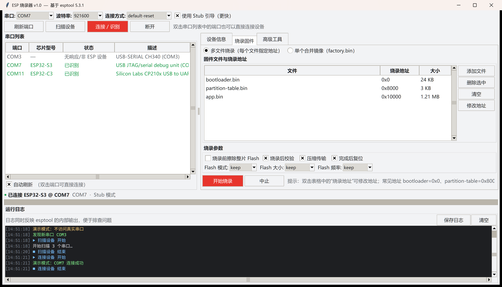
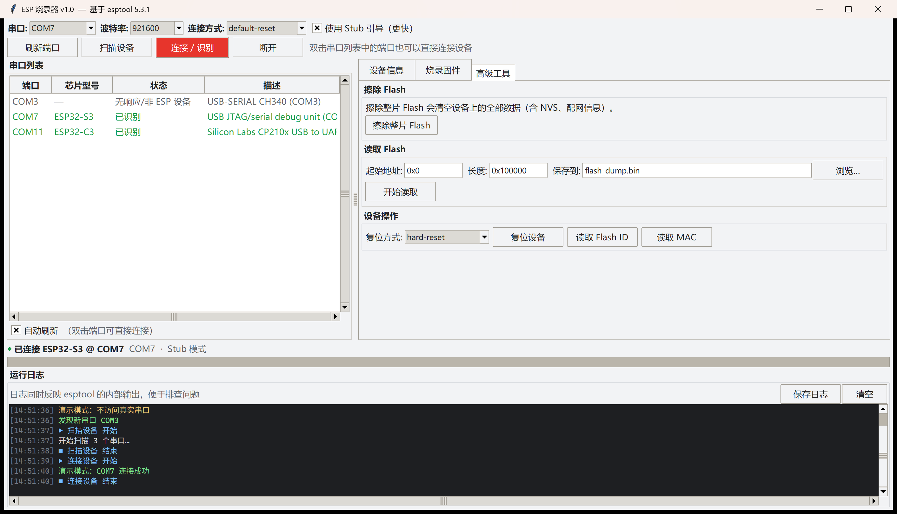
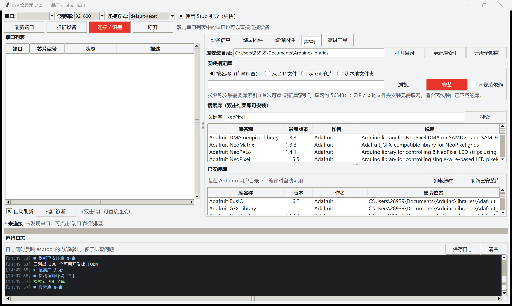
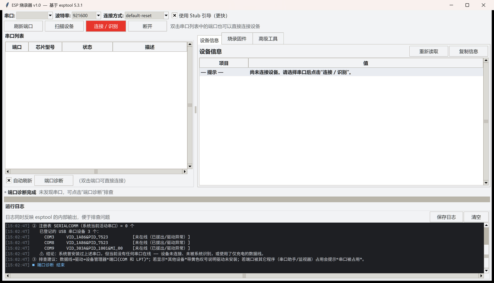

# ESP 烧录器（图形界面）

基于乐鑫科技（Espressif）开源命令行工具 **esptool 5.3.1** 打造的图形化 ESP 固件烧录工具，
使用 Python 标准库 **Tkinter** 编写，无需额外 GUI 依赖。

> 主程序：`esp_flasher_gui.py`　编译后端：`esp_compile.py`　启动脚本：`启动ESP烧录器.bat`
> 无硬件自检：`gui_selftest.py`　编译端到端测试：`compile_e2e_test.py`

---

## 关于本仓库

* 目录里同时包含 **esptool 5.3.1 源码**（`esptool/`、`espefuse/`、`espsecure/` …，GPL-2.0-or-later，
  许可证见 [LICENSE](LICENSE)）和本工具的界面/后端代码；
* **`toolchain/` 没有入库**（约 2.3 GB：Arduino CLI 1.5.1 + esp32 核心 3.0.7 + RISC-V GCC 12）。
  克隆后请自备 Arduino 环境，程序会自动探测并按芯片选择（见 6.1 / 6.2 节）：

  | 想要的芯片 | 需要装什么 |
  | --- | --- |
  | ESP32 / S2 / S3 | Arduino IDE 2.x + 开发板管理器里的 esp32 核心（2.x 即可） |
  | **ESP32-C6 / C2 / H2** | 必须 **esp32 核心 3.x 及以上**（C6 从 3.0 开始支持） |
  | ESP8266 | 开发板管理器里的 esp8266 核心 |

* 运行：

  ```bash
  python -m pip install -r requirements-gui.txt
  python esp_flasher_gui.py            # 或双击 启动ESP烧录器.bat
  python esp_flasher_gui.py --demo     # 无硬件预览界面
  ```

---

## 一、界面预览

**设备信息**：连接后自动读取芯片型号、版本、特性、MAC、Flash 与安全状态（下图为实机 ESP32-C6）



**编译固件**：把 `.cpp` / `.h` 源码编译成 `.bin`，并自动填入烧录页



**自动匹配已连接设备**：连上板子后自动选好编译环境、开发板与芯片



**烧录固件**：多文件带偏移烧录 / 单个合并镜像，支持擦除、压缩、校验与参数设置



**高级工具**：擦除整片 Flash、读取 Flash 到文件、复位设备、读取 Flash ID / MAC



**库管理**：按名称 / ZIP / Git / 本地文件夹安装库，并列出已安装库



**端口诊断**：扫描不到端口时，先看它给出的系统级结论



---

## 二、功能

| 功能 | 说明 |
| --- | --- |
| 扫描端口 | 列出全部串口（端口号、描述、VID:PID、序列号），插拔自动刷新 |
| 端口诊断 | 一键输出系统层面的排查信息：pyserial 枚举结果、注册表 SERIALCOMM、已登记但当前不在线的 USB 串口设备 |
| 扫描设备 | 逐个探测串口，直接显示 **芯片型号** 与 **状态**（已识别 / 无响应、非 ESP 设备 / 串口被占用 / 无法打开串口） |
| 设备识别 | 芯片型号、芯片描述、芯片版本、芯片特性、芯片 ID、MAC 地址、运行模式（ROM/Stub）、晶振频率 |
| Flash 信息 | 厂商（JEDEC ID 自动翻译）、器件 ID、容量、电压 |
| 安全状态 | 安全启动、Flash 加密、安全下载模式（SDM）、USB 模式 |
| **源码编译** | **把 `.ino` / `.cpp` / `.h` 编译成 `.bin`**：Arduino 工程、ESP-IDF 工程、任意 ELF→BIN，并可用 esptool 合并成 `factory.bin` |
| **库管理** | **安装指定库**：按名称 / 从 ZIP 文件 / 从 Git 仓库 / 从本地文件夹安装；搜索、列出已安装库、卸载、更新库索引、升级；编译因缺头文件失败时自动跳到本页并填好库名 |
| **按设备自动匹配** | 连接开发板后自动识别芯片，选好**编译环境**（多套 Arduino 工具链按芯片切换）、**编译方式**、**开发板 FQBN** 与各处芯片型号，并按设备实测值填 Flash 大小 |
| 固件烧录 | 多文件 + 地址（自动按文件名推荐 bootloader=0x0 / partition-table=0x8000 / app=0x10000）、单个合并镜像 |
| 烧录选项 | 烧录前擦除整片、压缩传输、烧录后校验、完成后复位、Flash 模式 / 大小 / 频率 |
| 编译烧录衔接 | 编译成功后产物自动填进“烧录固件”页，可直接点“开始烧录” |
| 高级工具 | 擦除整片 Flash（二次确认）、读取 Flash 保存为 bin、复位（hard/soft/watchdog）、读 Flash ID、读 MAC |
| 运行反馈 | 实时进度条 + 彩色日志（esptool 与编译器输出全部重定向到界面），可保存日志 |
| 其它 | 中止任务、复制设备信息到剪贴板、高 DPI 自适应、线程化执行不卡界面 |

演示模式（**不需要任何硬件**）可以查看完整界面：

```bash
python esp_flasher_gui.py --demo
```

---

## 三、环境与安装

* Python **3.10+**（esptool 5.x 要求）
* Windows / Linux / macOS 均可运行（Windows 上已验证）
* 依赖：esptool 本体（本目录源码）+ pyserial、rich_click、esp-pylib 等

```bash
# 在本目录（esptool-master）下执行
python -m pip install -r requirements-gui.txt
```

如果本机已经安装过 esptool，一般只缺少界面运行所需依赖时，上面的命令同样适用。

---

## 四、运行

**方式一（推荐）**：双击 `启动ESP烧录器.bat`
脚本会自动检查依赖、缺什么装什么，然后启动图形界面。
（批处理脚本内容保持纯 ASCII 以兼容任意控制台代码页，启动过程中提示信息为英文，
界面本身全部是中文。）

**方式二**：命令行

```bash
python esp_flasher_gui.py            # 正常模式
python esp_flasher_gui.py --demo     # 演示模式（不访问真实串口）
python esp_flasher_gui.py --tab=flash  # 启动即定位到"烧录固件"标签页
```

---

## 五、使用步骤

1. **插上开发板**（USB 线接开发板的 UART / USB 下载口），点击 **刷新端口**；
   列表会出现在左侧，Espressif 原生 USB（VID 303A）会以绿色显示。
2. 选中串口 → 点击 **连接 / 识别**（也可以直接双击端口）。
   程序会：连接 ROM → 加载 Stub 引导（可关）→ 切换到所选波特率 → 读取设备信息。
3. 想看所有串口的芯片型号，直接点 **扫描设备**，程序会逐个探测并填充
   "芯片型号" 与 "状态" 两列（探测时会短暂占用串口）。
4. 烧录：切到 **烧录固件** 页 → **添加文件**（自动填地址，双击"烧录地址"可改）
   → 勾选所需选项 → **开始烧录**。
   * 若是 `esptool merge_bin` 或 `idf.py` 生成的单个 `factory.bin`，
     选择 **单个合并镜像** 模式，地址填 `0x0` 即可。
5. 完成后设备默认自动复位；需要单独复位、擦除或备份 Flash 时用 **高级工具** 页。

> 首次烧录建议：波特率先用 `115200`，确认稳定后再提高到 `921600` / `1500000`。

---

## 六、把 C/C++ 源码编译成 .bin

界面第三个标签页 **编译固件** 提供四种编译方式，编译产物会自动填进"烧录固件"页，
编译完直接点"开始烧录"即可。


### 6.1 根据已连接设备自动选择（推荐）

**连上开发板 → 程序读芯片 → 自动选好编译环境、开发板和各处芯片型号。**


连接设备后（或手动点 **匹配已连接设备**）会自动完成：

| 自动设置项 | 依据 |
| --- | --- |
| **编译环境（工具链）** | 已连接设备的芯片。本机可能同时存在多个 Arduino 环境，各自能编译的芯片不同，程序会挑真正支持该芯片的那个 |
| **编译方式** | 源码目录的工程类型：有 `CMakeLists.txt` → ESP-IDF；否则 → Arduino |
| **开发板 FQBN** | 该芯片在该环境下的板卡，优先规范名（如 `esp32:esp32:esp32c6`）；下拉框只列这个芯片能用的板卡 |
| **ESP-IDF 目标 / ELF→BIN / 合并 BIN 的芯片** | 同上，一次全部同步 |
| **Flash 大小** | 设备实测值（如读回 4MB 就填 4MB） |

日志会写明每一步的选择依据，例如接上 **ESP32-C6** 时：

```
── 按已连接设备自动匹配（连接设备）：ESP32-C6 ──
选用编译环境：内置工具链（esp32:esp32 3.0.7）
自动选择开发板：esp32:esp32:esp32c6（该芯片共 10 块可选）
ESP-IDF 目标 / ELF→BIN / 合并 BIN 的芯片均设为 esp32c6
```

* 取消勾选 **自动匹配已连接设备** 后，编译设置完全由你手动指定；
* 手动改了开发板但和设备芯片不一致时，编译开始前会在日志里给出提醒；
* 匹配结果会显示在界面上（"已按已连接设备自动配置 —— 芯片 … 开发板 …"）。

### 6.2 环境要求

本程序会同时探测本机所有 Arduino 编译环境，并按芯片选择：

| 环境 | 本例中的情况 | 能编译的芯片 |
| --- | --- | --- |
| **内置工具链** `toolchain/` | Arduino CLI 1.5.1 + ESP32 核心 **3.0.7**（RISC-V GCC 12） | ESP32-C2 / C3 / C6 / H2 |
| **系统 Arduino IDE** | ESP32 核心 **2.0.9**（Xtensa + RISC-V） | ESP32 / S2 / S3 / C3（+ ESP8266） |

> 两套环境互补：C6/H2 只能在核心 3.x 上编译，而 3.x 的内置环境没装 Xtensa，
> 所以 ESP32/S2/S3 会自动走系统 Arduino IDE。程序按芯片自动切换，无需手工选。

| 编译方式 | 需要什么 | 怎么获得 |
| --- | --- | --- |
| Arduino 工程 | `arduino-cli` + 对应开发板核心 | 装 **Arduino IDE 2.x**（自带 arduino-cli，本程序会自动找到它），再在开发板管理器里装 esp32 支持包；C6 等新芯片需要核心 3.x |
| ESP-IDF 工程 | 已安装 ESP-IDF（含 `export.bat`），或设置 `IDF_PATH` | 用乐鑫官方安装器安装 |
| ELF → BIN | 只要 esptool（本程序自带），无需工具链 | — |
| 合并 BIN | 只要 esptool | — |

点 **检测环境** 可以在界面顶部看到各环境的检测结果，例如：

```
内置工具链（esp32:esp32 3.0.7）→ 可编译：ESP32-C2, ESP32-C3, ESP32-C6, ESP32-H2
系统 Arduino IDE（arduino:avr 1.8.6、esp32:esp32 2.0.9、esp8266:esp8266 3.1.2）
    → 可编译：ESP32, ESP32-C3, ESP32-S2, ESP32-S3, ESP8266
当前优先使用的 arduino-cli：...\toolchain\bin\arduino-cli.exe
ESP-IDF：未找到（仅在使用 ESP-IDF 工程时需要）
```

### 6.3 方式一：编译 Arduino 工程（最常用）

1. **源码目录**：选放代码的文件夹。
   * 目录里**有 `.ino`** → 直接按 Arduino sketch 编译；
   * 目录里**只有 `.cpp` / `.h`** → 程序自动把这些源文件复制成一个临时 sketch
     （目录名会作为 sketch 名），再编译——这就是"把 .cpp/.h 编译成 .bin"的用法。
2. **开发板 (FQBN)**：连接着设备时，点 **匹配已连接设备** 会自动选中对应的板卡，
   下拉框也只列该芯片能用的板卡；点 **刷新开发板列表** 可重新按当前芯片拉取。
   没有连接设备时默认给几个常用板卡（`esp32:esp32:esp32` / `esp32s3` / `esp32c3` / …）。
3. **输出目录**：留空则用 `源码目录/build_out`。
4. 勾选 **合并为单个 factory.bin**（推荐）：程序会按芯片自动确定偏移
   （bootloader 0x1000 / 分区表 0x8000 / boot_app0 0xe000 / 应用 0x10000；
   ESP32-S3/C3/C6 的 bootloader 在 0x0，偏移直接从核心的 `boards.txt` 读取），
   用 esptool `merge_bin` 合成一个文件，烧录时只需 `0x0` 一个地址。
5. 点 **开始编译**。日志会实时显示编译输出，完成后自动填入烧录页。

> 代码要求：使用 Arduino 风格，即提供 `setup()` / `loop()` 并使用 `Arduino.h` 的 API
> （`.ino` 会自动包含 `Arduino.h`，`.cpp` 请自己 `#include <Arduino.h>`）。
> 需要第三方库时，把库装到 Arduino 的 libraries 目录（或用 Arduino IDE 的库管理器）。

### 6.4 方式二：编译 ESP-IDF 工程

选工程目录（含 `CMakeLists.txt`）、目标芯片，点 **开始编译**。
程序会先 `call export.bat` 加载 IDF 环境，再执行 `idf.py build`，
然后收集 `build/bootloader/bootloader.bin`、`partition_table/partition-table.bin`、
`ota_data_initial.bin` 与 `build/<工程名>.bin`，可选合并成 `factory.bin`。

> 注意：本机未安装 ESP-IDF，此路径**未做过实机验证**（其余三种方式均已验证）。

### 6.5 方式三：ELF → BIN

任何工具链（ESP-IDF、PlatformIO、Arduino、你自己搭的 gcc 工程）编出来的 `.elf`，
选择芯片 / Flash 模式 / 大小 / 频率，点 **转换为 BIN** 即可得到可烧录镜像
（内部调用 esptool `elf2image`，纯 Python，不需要额外工具链）。

### 6.6 方式四：合并 BIN

已经有 bootloader / 分区表 / 应用等多个 bin 时，逐个 **添加文件**
（按文件名自动填 `0x1000` / `0x8000` / `0xe000` / `0x10000`，双击可改），
选芯片后点 **合并 BIN** 生成 `factory.bin`。

### 6.7 命令行等价

```bash
# 方式一
arduino-cli compile --fqbn esp32:esp32:esp32 --output-dir build_out 源码目录
esptool.py --chip esp32 merge_bin -o factory.bin \
  --flash_mode dio --flash_freq 40m --flash_size 4MB \
  0x1000 bootloader.bin 0x8000 partitions.bin 0xe000 boot_app0.bin 0x10000 app.bin

# 方式三
esptool.py --chip esp32 elf2image --flash_mode dio --flash_size 4MB app.elf -o app.bin
```

### 6.8 编译常见问题

| 现象 | 原因 | 处理 |
| --- | --- | --- |
| `Unknown FQBN: board esp32:esp32:esp32c6 not found` | 选了一个**本机核心里不存在**的板卡 | 程序现在会直接给出中文提示并列出本机已安装的核心；点 **刷新开发板列表** 只会列出真实可用的板卡 |
| ESP32-C6 / H2 / P4 等新芯片无法选择或编译 | **esp32 核心版本太旧**。核心 2.0.9 只支持 `esp32 / esp32s2 / esp32s3 / esp32c3` | 在 Arduino IDE 的「开发板管理器」把 esp32 升级到 3.x 及以上（C6/H2 从 3.0 开始支持） |
| 首次编译很慢 | 要编译整个 Arduino 核心 | 正常，之后增量编译通常在十几秒内 |
| 只有 `.cpp/.h`，报 `undefined reference to setup()` | 代码不是 Arduino 风格 | 提供 `setup()` / `loop()`，`.cpp` 里 `#include <Arduino.h>`；也可以给个 `main()` 走 ESP-IDF/PlatformIO 路线 |
| 缺少第三方库（`No such file or directory: xxx.h`） | 库没装到 Arduino 的 libraries | 用“库管理”页安装（见第七章）；编译失败时会自动跳过去并填好库名 |

> **PlatformIO 工程注意**：`platformio.ini` 里的 `build_flags`、`lib_deps`、`framework` 等
> 是 PlatformIO 的配置，本程序不会解析它们。这类工程建议：
> 用 PlatformIO 自己编译（`pio run`）后用 **ELF → BIN** 转换，或把需要的
> 宏/库手工搬到 Arduino 侧。
>
> **ESP-IDF 工程**：本机未安装 ESP-IDF，该路径未经实机验证；其余三种方式均已验证。

---

## 七、安装与管理库（编译缺库时用）

第四个标签页 **库管理**，用来安装/卸载 arduino-cli 编译时用到的第三方库。


### 7.1 四种安装方式

| 方式 | 用法 | 需要联网 |
| --- | --- | --- |
| **按名称** | 填库名（如 `Servo`，也可写 `Servo@1.3.0` 指定版本），点 **安装** | 是（走库索引） |
| **从 ZIP 文件** | 选 Arduino 库压缩包（GitHub Release 下载的那种 zip），点 **安装** | 否 |
| **从 Git 仓库** | 填仓库地址（可带 `#tag`，如 `https://github.com/xxx/yyy.git#1.2.0`） | 是 |
| **从本地文件夹** | 选一个库文件夹（含 `.h`/`.cpp`，最好有 `library.properties`） | 否 |

* 选好方式后可直接在输入框里编辑，**回车**等同于点“安装”。
* “从本地文件夹”会先自动打包成 Arduino 规范的 zip 再安装，`library.properties` 能被正确识别；
  没有该文件时按目录名打包，并在日志里提示。
* **搜索库**：输入关键字点“搜索”（或回车），结果里**双击某一行即可安装**。
* **已安装库**：列出库名/版本/作者/安装位置，可多选后 **卸载选中**；
  顶部还有 **更新库索引**（联网刷新可安装库清单）与 **升级全部库**。
* 两个表格之间是**可拖动的分栏**，可以按需要让搜索或已安装列表占更多高度。

> 库统一装在 **Arduino 用户目录**下的 `libraries`（本机为
> `C:\Users\28939\Documents\Arduino\libraries`），编译时 arduino-cli 自动使用，
> 因此内置工具链和系统 Arduino IDE 共用同一批库。

### 7.2 编译缺库时的联动

编译因为缺头文件失败（`fatal error: xxx.h: No such file or directory`）时，程序会：

1. 从编译日志里提取缺失的头文件名；
2. **自动切到“库管理”页**，把去掉 `.h` 后的名字填进搜索框与安装框，并自动搜索；
3. 在日志里给出提示 —— 安装完回到“编译固件”页重新编译即可。

例如缺 `Adafruit_NeoPixel.h` 时搜索框会自动填上 `Adafruit_NeoPixel`，双击结果即安装。

### 7.3 关于 `--zip-path` 的说明

arduino-cli 1.5 默认禁用从 ZIP / Git 安装（配置项 `library.enable_unsafe_install`）。
本程序在需要时会**把当前生效配置导出成一份临时配置**并打开该开关，
**不会改动你自己的配置文件**；日志里会显示“已为本次安装启用 …（临时配置）”。

### 7.4 命令行等价

```bash
arduino-cli lib list                                  # 已安装库
arduino-cli lib search NeoPixel                       # 搜索
arduino-cli lib install Servo                         # 按名称安装
arduino-cli lib install --zip-path DHT-sensor.zip     # 从 ZIP 安装（需开启 unsafe install）
arduino-cli lib install --git-url https://github.com/xxx/yyy.git
arduino-cli lib uninstall Servo                       # 卸载
arduino-cli lib update-index                          # 更新库索引
arduino-cli lib upgrade                               # 升级全部
```

---

## 八、常见问题

### 8.1 扫描不到任何端口

先点界面左下角的 **端口诊断**，它会输出这样的报告：


```
① pyserial comports() 枚举到 0 个串口
② 注册表 SERIALCOMM（系统当前活动串口）= 0 个
   已登记的 USB 串口设备 3 个：
     COM3     VID_1A86&PID_7523          [未在线（已拔出/驱动异常）]
     COM8     VID_1A86&PID_7523          [未在线（已拔出/驱动异常）]
     COM9     VID_303A&PID_1001&MI_00    [未在线（已拔出/驱动异常）]
   ⚠ 结论：系统曾安装过上述串口，但当前没有任何串口在线
```

按报告结论对号入座：

| 报告现象 | 原因 | 处理 |
| --- | --- | --- |
| `SERIALCOMM = 0` 且“已登记的设备”里有你的板子 | 系统认识这块板，但此刻没连上 | 换一根**数据线**（很多线只供电）、换 USB 口（直连主机，别用扩展坞）、重新插拔，确认板子电源灯亮 |
| `SERIALCOMM = 0` 且“未发现任何已登记的 USB 串口设备” | 本机从未识别过串口设备 | 装驱动：CH340/CH341、CP210x、FTDI，或 ESP32-S2/S3/C3 原生 USB（Windows 自带 usbser，插上即可） |
| 设备管理器“端口(COM 和 LPT)”里没有 COM 口，但“其他设备”有黄色叹号 | 驱动没装好 | 右键该设备 → 更新驱动，或用驱动总裁/厂商驱动安装 |
| pyserial 能列出 COM 口，但状态显示“串口被占用” | 端口被别的程序打开 | 关闭串口助手、Arduino IDE 串口监视器、`idf.py monitor`、PlatformIO 监视器等 |
| 端口号很大（如 COM20+） | 正常现象，Windows 分配的历史端口号 | 可用设备管理器“端口设置 → 高级”改成小号，或不改 |

> 另：ESP32-S2/S3/C3 等自带 USB 的芯片插上后出现的是“USB 串行设备 (COMx)”（VID 303A:1001），
> 而外置 CH340/CP210x 转串口板是另一类设备，两者都可能出现，按需要选对应的那个。

### 8.2 其它问题

| 现象 | 处理 |
| --- | --- |
| 串口列表为空 | 见上面 8.1 |
| 状态显示"串口被占用" | 关闭串口监视器（Arduino IDE、idf.py monitor、串口助手）后重试 |
| 状态显示"无响应/非 ESP 设备" | 芯片不在下载模式：按住 BOOT 再点一下 RESET（或复位后重试）；也可能是非 ESP 设备 |
| 连接失败但端口存在 | 尝试把"连接方式"改为 `usb-reset`（原生 USB 芯片 ESP32-S2/S3/C3 等）或 `no-reset` |
| 显示"安全下载模式 (SDM)" | 芯片被锁定，只能做有限操作；无法加载 Stub，烧录需自行确认授权 |
| 高波特率烧录失败 | 降回 115200 重试；长线/劣质线材容易出现误码 |
| 中止任务 | "中止"会强制关闭串口；**烧录过程中强行中止可能需要给设备重新上电** |

错误信息的完整内容（含 esptool 原始提示）都会写在界面下方的"运行日志"里，
可以点 **保存日志** 导出后排查。

---

## 九、与 esptool 命令行的对应关系

| 界面操作 | 等价的 esptool 命令 |
| --- | --- |
| 扫描设备 | `esptool.py --port COMx chip-id` （本工具用 `detect_chip()` API 快速探测） |
| 连接 / 识别 | `esptool.py --port COMx --baud 921600 flash-id` 等信息的集合 |
| 开始烧录 | `esptool.py --port COMx --baud 921600 write-flash 0x0 bootloader.bin 0x8000 partition-table.bin ...` |
| 烧录前擦除整片 | `write-flash --erase-all` |
| 烧录后校验 | `esptool.py verify-flash ...` |
| 擦除整片 Flash | `esptool.py erase-flash` |
| 读取 Flash | `esptool.py read-flash 0x0 0x100000 dump.bin` |
| 复位设备 | `esptool.py --after hard-reset ...` |
| 编译固件 | `arduino-cli compile ...` / `idf.py build`（见第六章） |
| ELF → BIN | `esptool.py elf2image ...` |
| 合并 BIN | `esptool.py merge_bin ...` |

---

## 十、自检与测试

### 10.1 无硬件自检（不需要任何硬件）

```bash
python gui_selftest.py
```

在演示模式下构建界面、扫描端口、探测芯片、连接读信息、走一遍烧录任务状态机，
并校验编译后端（环境探测、`.cpp/.h` 包装、产物清单、合并、ELF→BIN、产物回填烧录页、
按已连接设备自动匹配）：

```
[1] 端口枚举 OK: ['COM3', 'COM7', 'COM11']
[2] COM3   型号=—         状态=无响应/非 ESP 设备
[2] COM7   型号=ESP32-S3  状态=已识别
[2] COM11  型号=ESP32-C3  状态=已识别
[3] 设备信息 OK: 23 项，芯片型号=ESP32-S3
[4] 烧录参数校验 OK
[5] 地址自动建议 OK
[6] 日志输出 OK: 23 行
[7] 烧录流程 OK: 进度=100%
[8] 编译环境探测 OK: arduino-cli=有, ESP-IDF=无
[9] 合并 BIN OK: factory.bin=69632 字节
[10] ELF→BIN OK: 144 字节, entry=0x400d0020
[11] 编译产物填充烧录页 OK
      内置工具链（esp32:esp32 3.0.7）→ 可编译：ESP32-C2, ESP32-C3, ESP32-C6, ESP32-H2
      系统 Arduino IDE（arduino:avr 1.8.6、esp32:esp32 2.0.9、esp8266:esp8266 3.1.2）
         → 可编译：ESP32, ESP32-C3, ESP32-S2, ESP32-S3, ESP8266
[12] 自动匹配 OK: esp32c6→内置工具链, esp32s3→系统 Arduino IDE
[13] 库目录 OK: C:\Users\28939\Documents\Arduino\libraries
[14] 库安装/卸载 OK（隔离环境，未改动真实库目录）

自检通过 ✔
```

### 10.2 编译端到端测试（真实调用 arduino-cli）

```bash
python compile_e2e_test.py                 # 默认 esp32:esp32:esp32（系统工具链）
python compile_e2e_test.py esp32:esp32:esp32c6   # ESP32-C6（内置工具链）
```

它会临时生成一个**只有 `.cpp` / `.h`** 的目录，走完整链路：
包装成 sketch → 编译 → 收集产物 → 合并 `factory.bin` → 填入烧录页，并校验镜像头。
没有 arduino-cli 或对应核心时会自动跳过（退出码 0）。

```
arduino-cli : C:\Program Files\Arduino IDE\...\arduino-cli.exe
目标开发板  : esp32:esp32:esp32
源码目录    : ...\blink_cpp（只有 .cpp/.h，没有 .ino）
编译耗时    : 12.0 秒
状态        : 编译完成 | 产物已填入烧录页，可直接点“开始烧录”
factory.bin : 326960 字节，镜像头校验通过
烧录页      : 已自动填入 factory.bin @0x0

端到端编译测试通过 ✔
```

### 10.3 实机验证记录

在 **ESP32-C6**（USB-Serial/JTAG，VID:PID 303A:1001）上验证过：

* 端口扫描、设备扫描（识别为 `ESP32-C6 / 已识别`）；
* 连接并读取：描述 `ESP32-C6FH4 (QFN32) (revision v0.2)`、特性、MAC、
  晶振 40 MHz、Flash 容量 4MB、USB-Serial/JTAG 模式、安全状态；
* 用 `.cpp` + `.h` 源码编译出 `factory.bin` 并填入烧录页。

自动匹配功能验证：

* 演示设备 `ESP32-C6` → 选中 **内置工具链** + `esp32:esp32:esp32c6`；
  `ESP32-S3` → 选中 **系统 Arduino IDE** + `esp32:esp32:esp32s3`；
* 用自动匹配选出的设置真实编译 ESP32-C6 工程，得到 288208 字节的 `factory.bin`
  （0x0 处 bootloader、0x8000 分区表、0x10000 应用镜像头均校验通过）。

---

## 十一、实现要点

* 直接调用 esptool 的 Python API：`detect_chip()` → `run_stub()` → `change_baud()` →
  `attach_flash()` → `write_flash()/verify_flash()/erase_flash()/read_flash()` → `reset_chip()`，
  与 esptool 官方 CLI 的连接/烧录时序完全一致。
* 通过 `esp_pylib.logger.EspLog.set_logger()` 安装自定义日志器（`GuiLog`），
  把 esptool 的 `print/warn/err` 与进度条回调全部转发到界面队列，日志与进度无需解析 stdout。
* 编译后端独立成 `esp_compile.py`：不依赖 Tk，外部命令统一走 `run_stream()`
  逐行回调输出，界面可实时显示 `arduino-cli` / `idf.py` 的编译日志。
* **多工具链按芯片自动选择**：`detect_toolchains()` 探测每个 Arduino 环境
  （内置 `toolchain/` 与系统 Arduino IDE）安装了哪些核心，再用核心 `boards.txt` 的
  `build.mcu` 与已安装的编译器目录（`esp-rv32` / `xtensa-esp32s3-elf-gcc` …）求交集，
  得出"这个环境实际能编译哪些芯片"；`resolve_toolchain(chip=…)` 据此挑环境。
  芯片名先做归一化（`ESP32-C6` → `esp32c6`），否则会被误判成 `esp32`。
* 库管理走 `arduino-cli lib ...`；从 ZIP/Git 安装时把当前生效配置导出成临时配置并打开
  `library.enable_unsafe_install`（默认关闭），不修改用户自己的配置。
* 合并镜像的地址来源可靠：优先读 Arduino 核心的 `boards.txt`
  （`<board>.build.bootloader_addr`），读不到再用芯片默认表，避免 S3/C3/C6 与 ESP32 的 bootloader 偏移差异。
* Tk 只能在主线程访问，因此所有任务运行在后台线程，界面只通过 `queue` + `after()` 轮询更新；
  任务开始前用 `_snapshot_options()` 把控件状态快照成普通字典供工作线程使用。
  环境探测 / 开发板列表这类只读任务用 `blocking=False`，不会把界面置为"忙"。
* 按 DPI 缩放系数（`winfo_fpixels("1i")/96`）换算窗口尺寸、分栏位置、列宽与控件间距，
  在 100%~200% 缩放下布局均正常。

---

## 十二、文件清单

| 文件 | 说明 |
| --- | --- |
| `esp_flasher_gui.py` | 图形界面主程序 |
| `esp_compile.py` | 编译后端 + 多工具链探测与自动匹配 + 库管理 |
| `toolchain/` | 内置 ESP32-C6 编译环境（Arduino CLI + 核心 3.0.7 + RISC-V GCC） |
| `启动ESP烧录器.bat` | Windows 一键启动（含依赖自检） |
| `requirements-gui.txt` | 运行依赖清单 |
| `gui_selftest.py` | 无硬件自检脚本（14 项） |
| `compile_e2e_test.py` | 编译端到端测试（真实调用 arduino-cli） |
| `gui_screenshot_real.png` | 实机 ESP32-C6 设备信息 |
| `gui_screenshot_compile.png` | 编译固件页（真实编译过程） |
| `gui_screenshot_automatch.png` | 按已连接设备自动匹配 |
| `gui_screenshot_lib.png` | 库管理页 |
| `gui_screenshot_flash.png` / `gui_screenshot_tools.png` / `gui_screenshot_diag.png` | 烧录页 / 高级工具 / 端口诊断 |

本工具调用的是本目录下的 esptool 源码（`esptool/`，v5.3.1），许可证与 esptool 保持一致
（GPL-2.0-or-later）。
